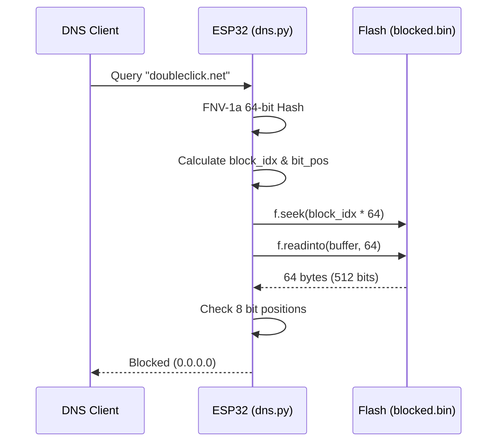
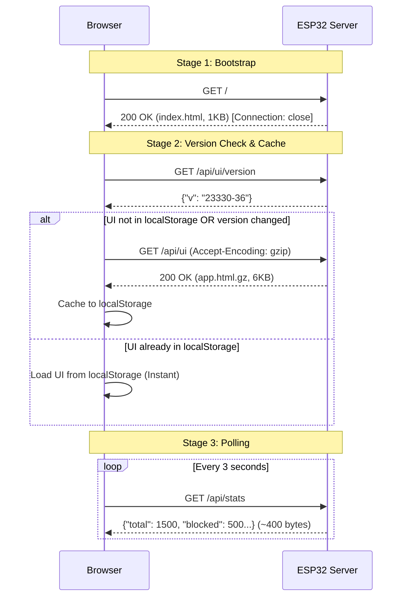

# ESP32 AdBlocker Architecture

This document details the internal architecture, memory management, and optimizations that allow a massive 230K+ domain blocklist to run efficiently on an ESP32 with only ~132KB of available RAM.

---

## 1. DNS Blocking Pipeline

Each DNS query passes through five specialized layers. The first match wins, and the query is resolved or blocked immediately.

```mermaid
flowchart TD
    Q([Incoming DNS Query]) --> L1{1. Local Bypass}
    L1 -- ".local / .arpa" --> Allow([Allow - Zero Latency])
    L1 -- "Other" --> L2{2. Static Safelist}
    L2 -- "Match" --> Allow
    L2 -- "No Match" --> L3{3. Dynamic Safelist\n(GCT)}
    L3 -- "Match & < 30 req/min" --> Allow
    L3 -- "Abuse > 30 req/min" --> Demote[Demote from Safelist]
    L3 -- "No Match" --> L4{4. Heuristics}
    Demote --> L4
    L4 -- "ad12.example.com" --> Block([Block - Heuristic])
    L4 -- "No Match" --> L5{5. Keywords}
    L5 -- "'telemetry', 'analytics'" --> Block([Block - Keyword])
    L5 -- "No Match" --> L6{6. Blocked Bloom Filter}
    L6 -- "Match" --> Block([Block - Hash])
    L6 -- "No Match" --> Resolve([Resolve Upstream])
```

### Layer Details
1. **Local Network Bypass**: Bypasses checks for `.local` (mDNS) and `.arpa` (Reverse DNS). Ensures smart-home devices communicate with zero CPU overhead.
2. **Static Safelist**: Exact string matching for a predefined tuple of essential domains.
3. **Dynamic Safelist (GCT)**: Thread-safe dictionary of domains rescued by the background Consensus Trust daemon. Includes automatic abuse protection (demotion if >30 requests/minute).
4. **Heuristics**: Checks if the first label starts with `ad` followed by an empty string, `s`, or numbers (e.g., `ads.`, `ad12.`).
5. **Keywords**: Scans for known tracking keywords (`telemetry`, `analytics`, etc.).
6. **Blocked Bloom Filter (BBF)**: Performs a single 64-byte flash read to check membership in the 1.2MB bitmap.

---

## 2. Blocked Bloom Filter (BBF) Design

To fit 230K+ domains into the ESP32's tiny 2MB filesystem with **zero RAM overhead**, the system uses a blocked Bloom Filter architecture.



1. **Partitioning**: The 1.2MB filter is divided into **18,750 blocks** of **64 bytes (512 bits)** each.
2. **Double Hashing**: Using the Kirsch-Mitzenmacher technique, 8 orthogonal bit positions inside the 512-bit block are mapped.
3. **Single Read Seek**: The ESP32 seeks directly to the calculated block and reads 64 bytes into a pre-allocated `bytearray(64)`. This achieves `< 1ms` lookup time with **zero memory allocation**.

---

## 3. Web Server & UI Architecture

To serve a rich React-like UI without exhausting the ESP32's limited LwIP socket pool (max 8 concurrent connections), the system employs a **3-Stage Progressive Loading** architecture combined with network-level TCP tuning.



### TCP Delayed ACK Mitigation
On Windows and iOS, HTTP clients wait ~200ms to send an ACK for the HTTP Header before accepting the HTTP Body (TCP Delayed ACK). To bypass this latency penalty on the ESP32:
```python
# BAD: Triggers 200ms latency on Windows/iOS
conn.sendall(header.encode())
conn.sendall(body.encode())

# GOOD: Combined payload, sub-50ms latency
conn.sendall(header.encode() + body.encode())
```

---

## 4. Graduated Consensus Trust (GCT)

GCT is an automated self-healing layer designed to bypass false positives in upstream blocklists without user intervention.

1. **Consensus Queue**: When a domain triggers the BBF, it's added to a background queue.
2. **Polling**: A background thread queries Google DNS against AdGuard, Control D, and Mullvad. If the adblockers agree the domain is clean, it is whitelisted.
3. **Graduated TTL**:
   - *Level 0*: 5 minutes whitelisting.
   - *Level 1*: 1 hour whitelisting.
   - *Level 2*: 24 hours whitelisting.

---

## 5. Memory Optimizations

- **Garbage Collection (GC)**: The MicroPython heap is strictly limited. The web server and DNS proxy manually invoke `gc.collect()` at strategic intervals.
- **Streaming Uploads**: The `/api/upload` endpoint streams incoming binary files to LittleFS in 1KB chunks and runs `gc.collect()` every 8KB. This prevents `MemoryError` when uploading the 1.2MB blocklist.
- **Defensive TCP Accept Loop**: The server implements an outer `try-except` loop to catch `ENOBUFS` or `MemoryError` when clients spam requests. It backs off for 100ms and recovers the socket, preventing background thread death.
